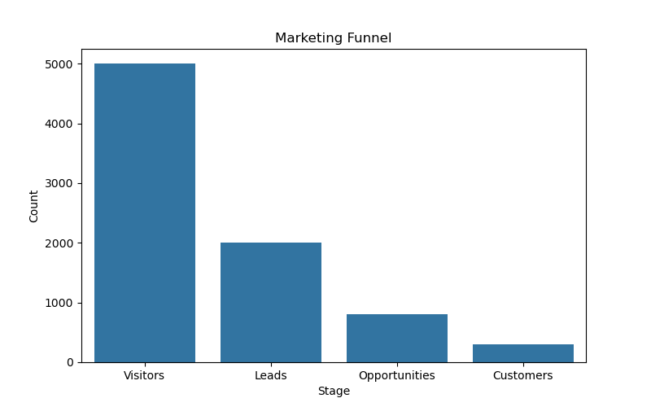

#  Marketing Funnel & Conversion Analysis

 Data Science & Analytics Project

---

##  Objective
Analyze the marketing funnel to identify user drop-offs and evaluate conversion performance across different stages.

---

##  Tools Used
- Python (Pandas, Matplotlib, Seaborn)

---

##  Funnel Overview

The marketing funnel consists of the following stages:
- Visitors → Leads → Opportunities → Customers

---

##  Key Insights

### 1. Funnel Drop-off
A significant drop-off is observed between Visitors and Leads, indicating that many users do not convert into potential customers.

---

### 2. Conversion Performance
Each stage shows a decline in user count, with the highest drop occurring at the top of the funnel.

---

### 3. Bottleneck Identification
The largest bottleneck exists in the early stage of the funnel, highlighting issues in lead generation and initial user engagement.

---

##  Visualization

---

##  Recommendations

- Improve landing page experience to convert more visitors into leads  
- Optimize marketing campaigns for better targeting  
- Enhance engagement strategies during early stages  
- Focus on nurturing leads to improve conversion rates  

---

##  Conclusion
Optimizing the early stages of the marketing funnel can significantly increase overall conversion rates and business growth.

---
